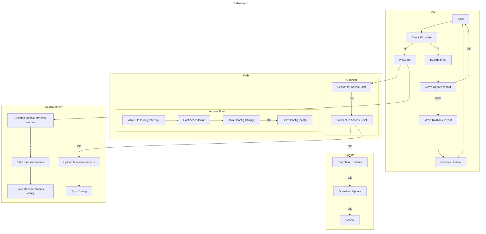

# Schedule
 

```mermaid
---
title: Behaviour
---

flowchart TD

subgraph Boot
BO[Boot]
-->CU[Check if Update]--N-->WU
CU--Y-->BF[Backup Files]-->MU[Move Update to root]
--NOK-->R[Move Rollback to root]-->RU[Remove Update]-->BO
MU--OK-->BO
end

subgraph Web
 subgraph Connect
 WU[Wake Up]
 WU-->SAP[Search for Acces Point]
 --OK-->CAP[Connect to Access Point]
 end

 subgraph Access Point
 I[Wake Up throug Interrupt]
 -->HAP[Host Acces Point]
 -->AC[Await Config Change]
 --OK-->SC[Save Config locally]
 end
end

subgraph Update
CAP--OK-->SU[Search for Updates]
--OK-->DU[Download Update]
--OK-->RB[Reboot]
end

subgraph Meassurement
CAP--OK-->UM[Upload Meassuerements]
-->DC[Sync Config]

WU-->CM[Check if Meassuerments are due]
--Y-->M[Take meassurements]
-->SM[Save Meassurements locally]
end

click BF href "https://github.com/ZbindenDaniel/Birgisch/blob/main/iot/source/boot.py#:~:text=backup_files"

```

