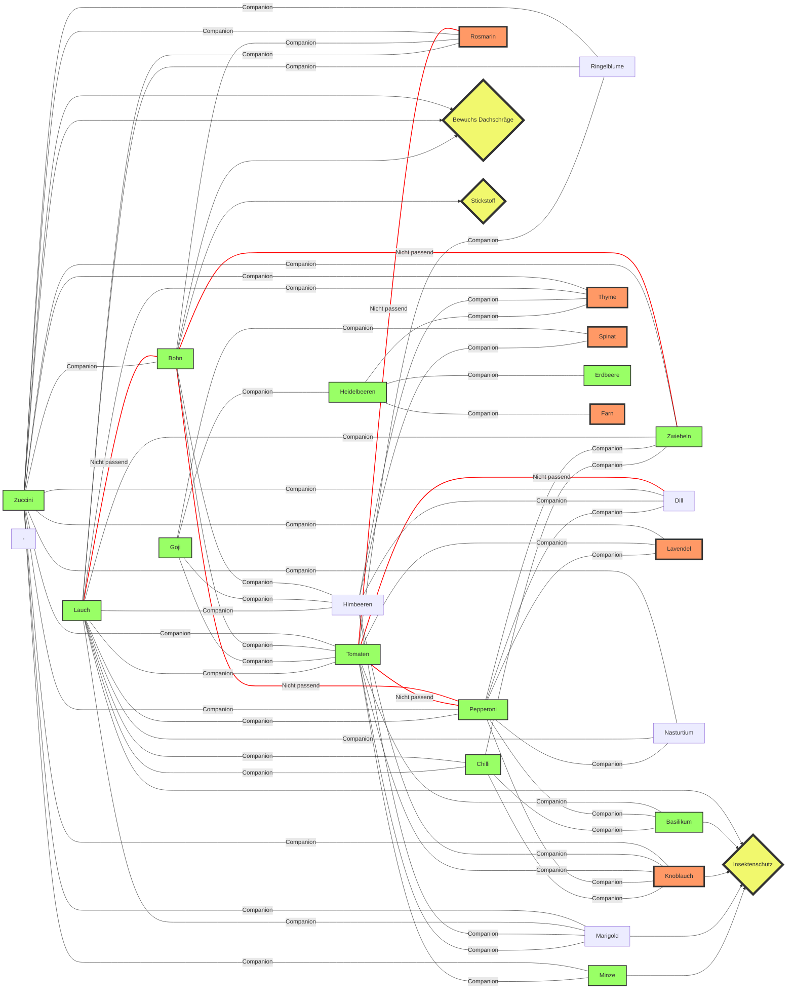

 Gemüsegarten in der Bucheggstrasse 131 
# Plan
Es gibt mehrer Gründe für eine schön bepflanzte Terasse. Sei es um etwas übers Gärtnern zu lernen, einen schönen Platz zur Erholung zu schaffen oder um etwas Gemüse selber zu produzieren. 

Von der Gesamtfläche von 18m2 sind 11m2 begehbar und 11m2 gehöhren zu Dachschräge. Diese Dachschräge soll ausgenutzt werden um einerseits die Begehbare Fläche begehbar zu lassen und andererseits hoffentlich einen geringen kühlungseffekt für die dahinterliegende Küche zu erreichen. Auf die Liste der Pflanzen gehört also sicherlich rankende Pflanzen, die das Dach hochklettern können.

Da viel Fachwissen fehlt wird eine Mischung aus Bauchgefühl und Auschlussverfahren angewendet. Mittels [[Companions]]
wird ausgewählt welche Pflanzen einer vorhin getroffenen Auswahl zusammen passen und welche sich gegenseitig positiv beeinflussen.
> Um relevante Daten aus dem Versuch zu erhalten würde es natürlich eine referenz Aufbau ohne Companion planting benötigen aber hierauf wird verzichtet. Die Erwartung ist aber das wenig Schädlingsbefall und Krankheiten auftreten.

Auch mit Beeren soll experimentiert werden. Diese werden wohl im ersten Jahr noch keine Früchte tragen.
- Wilde Erdbeeren (bereits Vorhanden)
- Heidelbeeren
- Gojibeeren

Mit diesen Voraussetzungen und Anforderungen ergeben sich folgende Anforderungen an die Pflanzenauswahl:
1. Wuchernde Pflanzen die die Dachschräge erklettern können.
2. Pflanzen die möglichst Nahrung produzieren die mir schmeckt
3. Pflanzen die Bestäuber und Insekten anziehen
4. pflanzen, die gut zueinander passen, ähnliche Bedürfnisse haben
5. Pflanzen die Schädlinge abhalten [Link](https://www.dehner.de/ratgeber/pflanzen-tipps/ratgeber-top-10-pflanzen-gegen-schaedlinge/)
Das heisst es benötigt sicherlich Pflanzen die gerne klettern und ein dichtes Blätterdach haben. Dafür wurde eine Kombination aus [Zucchini](https://www.superseeds.com/products/green-machine-zucchini-organic-f1-hybrid-45-days) und [Bohnen](https://www.gardeningknowhow.com/ornamental/vines/scarlet-runner-bean/growing-scarlet-runner-beans.htm)

Die Pflanzen die anhand dieser Kriterien in Frage kommen:

- Tomaten
- Chilli
- Pepperoni
- [Zucchini](#zucchini)
- [Lauch](#lauch)
- Basilikum
- [Heidelbeeren](#heidelbeere)
- [Gojibeeren](#goji-beere)
  
Dazu kommt ein Vertreter aus der Familie der [Leguminosen](https://www.ruralsprout.com/nitrogen-fixing-plants/):

- Bohnen
  
> Zudem werden Kräuter und Wildblumen eingesäät um einerseits Schädlinge abzuhalten und andererseits Bestäuber anzulocken. Grundsätzlich sollen möglichst viele Insekten angelockt werden, damit ein kleines Ökosystem entsteht, das sich selbst in einem gewissen Rahmen balancieren kann.

Die Beziehungen dieser Pflanzen sehen wiefolgt aus:

Zu den Pflanzen, die vorgeshen waren (Grün) haben sich während den nachforschungen noch Ergänzungen gesellt, die positive Einflüsse haben können und zudem gut in die Küche passen. Die Erkentnisse aus der Analyse wurden nicht strikt umgesetzt, da schon vor der Analyse mit der Plannung und dem Pflanzen begonnen wurde 🤷‍♂️
Es stehen fünf grössere Gefässe sowie ein paar kleiner Töpfe zur Verfügung.
Die getroffene Auswahl soll wie folgt verpflanzt werden:
- ein Zucchini/Bohnen Konsortium bildet den Schwerpunkt des Gartens. Damit wird die Dachschräge begrünt. Als Insektenschutz hilft hier ein Rosmarin Strauch. Dazu kommen Ringel- und Wildblumen, die Insektenleben anziehen sollen.
- Tomaten, Chilli, Basilikum Trio, damit eine leckere homegrown Salsa entsthen kann. Etwas Minze soll das Trio ergänzen.
- Pepperoni, Chilli, und Knobli würden auch gut passen. Für den Knoblauch ist es aber bereits zu spät. Dieser wird versuchsweise durch ein paar Zwiebeln ersetzt. 
- Die Heidelbeere bildet ein kleines Wald-Habitat zusammen mit der Erdbeere. Thymian sollte dazu passen und Schädlinge etwas zurückhalten
- Einige Lavendel Pflanzen gemischt mit weiteren Wildblumen locken weitere bestäuber an.
- Die Goji-Beere liegt etwas abseits vom Rest und krigt zur Beschattung ihrer Wurzel etwas Spinat.
  

Das ganze soll aber flexibel gehalten werden. Das heisst alles das wächst und nicht anderen Wachstum stoppt darf gerne wachsen. Alles was sich noch ergibt wird noch gepflanzt.

<figure markdown>

<figcaption>Fig.1 - Plan für die Bepflanzung der Terasse</figcaption>
</figure>

Da sich das Projekt stetig entwickelt, ist der geplante Aufbau nicht mehr aktuell.
Mittlerweile haben sich noch mehr Pflanzen dazu gesellt. Zudem habe ich verschiedene Materialien wie Steine, Stöcke und dergleichen hinzugefügt um Raum für Insekten schaffen und diesen Zugang zu Wasser und Schutz bieten, sowie  die Pflanzengefässe for direkter Sonneneinstrahlung zu schützen. Auch gibt es einen kleinen Topf mit Farnen und Moosen der ebenfalls noch integriert wird.

# Liste mit Pflanzen
*Einzeln:*
- Baby Haselnussstrauch
- 3x Tomaten
- Ananassalbei
- Lavendel
- ...

# Pflanzeninfos
## Zucchini
Zucchini gehören zu den anfängerfreundlichsten Gemüsesorten überhaupt. Wenn Sie die Blattläuse, Kürbiswanzen und Gurkenkäfer in Schach halten können, können Sie im Laufe des Sommers Dutzende von Pfund Kürbis aus einer einzigen Pflanze ernten.

Begleitpflanzen sind genau die richtigen Helfer für diese Aufgabe, denn sie bieten einen doppelten Schutz: Sie wehren Schädlinge mit starken Düften ab und locken mit nektarreichen Blüten nützliche Räuber an (die Schädlinge fressen).

Gleichzeitig locken viele der besten Begleiter Bestäuber an, die dafür sorgen, dass alle Kürbisblüten die Bestäubung erhalten, die sie zur Fruchtbildung benötigen. Denken Sie daran, dass Zucchini ziemlich wettbewerbsfähig und stachelig sein können. Im Zweifelsfall sollten Sie für zusätzlichen Platz zu den Begleitpflanzen sorgen.

Das Fruchtgemüse ist einjährig. Aus einem kräftigen Haupttrieb wachsen dicht gedrängte Blattstiele und Blütentriebe zu einer ausladenden buschigen Pflanze. An den langen hohlen und behaarten Stielen sitzen große, meist herzförmig gelappte Blätter. Die großen gelben Blüten öffnen sich zu sternförmigen Schalen. Zucchini sind einhäusig, das bedeutet, dass an einer Pflanze sowohl männliche als auch weibliche Blüten erscheinen. Die männlichen Blüten sitzen auf einem dünnen, langen Stängel. Weibliche Blüten haben nur kurze Stiele und sind bei vielen Sorten noch einige Zeit fest mit den reifenden Früchten verbunden.

### [Companions](https://www.allaboutgardening.com/zucchini-companion-plants/)
[Mehr](https://www.allaboutgardening.com/zucchini-companion-plants/#:~:text=a%20fence%20post.-,Beans,space%20above%20a%20zucchini%20canopy.)

### Pflanzen
 - Bevorzugen einen sonnigen bis halbschattigen Standort 
 - Benötigen einen nährstoffreichen, lockeren sowie humosen Boden. 
 - Frostempfindliche Lagen sind zu vermeiden, da das Fruchtgemüse sehr wärmeliebend ist.
 - 80 bis 100cm Abstand
 - Sie sollten stets mindestens zwei Pflanzen setzen, sodass diese sich gegenseitig befruchten können.
- Wann
    - Ab Mai

### Pflege
- Zucchini sind Starkzehrer und benötigen daher eine gute Versorgung mit Nährstoffen
    - Nettle-Juice

### Ernte
Sechs bis acht Wochen nach der Pflanzung sind bis zu fünf Früchte in der Woche reif. Ernten Sie Zucchini am besten, sobald sie 10 bis 15 Zentimeter lang sind. 

### Troubleshoot
#### Bestäuben
Die männliche Blüte (länglicher Stiel) abschneiden, Blüttenblätter entfernen. Sollten Pollen dran haben. weibliche Blüte andere Pflanze öffnen und Pollen auf Blütennarbe tupfen. Fertig!
#### Echter Mehltau
Mehltau ist eine häufige Krankheit, obwohl Sie sie in Goji-Beeren nicht häufig sehen werden. 
#### Fransenflügler
Das Letzte, was Sie wollen, ist ein Thripsbefall

#### Nicht passend!
**Andere Kürbisgewächse**: Gurken, Kürbisse, Winterkürbisse und Melonen ziehen alle die gleichen Schädlinge und Krankheiten an. Außerdem können sie sich leicht gegenseitig befruchten. Am besten ist es, sie mit nützlichen Begleitern oder anderen Gemüsesorten zu mischen.

**Süßkartoffeln**: Süßkartoffeln, die an den Ranken wachsen, können leicht mit Zucchini kollidieren und ein Unkraut-Albtraum werden.

**Kartoffeln**: Kartoffeln mögen es gar nicht, wenn sie von kräftigen Zucchinipflanzen überfüllt oder beschattet werden.

**Fenchel**: Fenchel ist dafür bekannt, dass er allelopathische Eigenschaften hat, die das Wachstum von Pflanzen in der Nähe hemmen. Er neigt dazu, ein Einzelgänger im Garten zu sein.

## Goji Beere
### Allgemeines
- Goji-Beeren sind in Ostasien beheimatet und enthalten die Vitamine A und C. Sie sind auch reich an Antioxidantien. Stammen aus der Familie der Nachtschattengewächse 
- Sie gehören zur gleichen Familie wie Tomaten und brauchen daher ähnliche Bedingungen.
- PH 6.5 - 8.1
### Pflanzen
 - Der Boden sollte gut durchlässig und lehmig sein.
 - 1m zwischen Pflanzen
- Wann
    - Frühjahr nach dem letzten Frost

### Pflege
- leichter zu ernten, wenn Sie sie entlang eines Spaliers oder einer anderen Stütze trainieren.
- Nicht stark düngen.

### [Companions](https://morningchores.com/growing-goji-berries/)
- Tomatillos
- Heidelbeeren
- Weintrauben
- Himbeeren
- Tomaten
- Rote und weiße Johannisbeeren

### Ernte
- Wenn Früchte dunkelrot sind.
### Troubleshoot
#### Anthracnose
Dies ist eine Pilzkrankheit, die Sie überrascht. Gerade wenn Sie denken, dass Sie Anthracnose für die Saison besiegt haben, infiziert es die Frucht, während sie reift.
#### Echter Mehltau
Mehltau ist eine häufige Krankheit, obwohl Sie sie in Goji-Beeren nicht häufig sehen werden. 
#### Fransenflügler
Das Letzte, was Sie wollen, ist ein Thripsbefall

## Heidelbeere
### Allgemeines
 - Mag es:
    - Hummusreich
    - Kalkfrei
    - gleichmässig feucht
    - PH 4-5
    - sandig, sauerer boden
    - Wurzeln wachsen in die Breite
 - Kulturformen (weisses Fleish)
        - werden grösser, mehr Ertrag
### Pflanzen
- Wie
    - erhöht setzen damit Wurzeln Luft kriegen
    - mit Nadelbaumholz mulchen oder in Erde verteilen
    - mindestens zwei Pflanzen, am besten zwei Sorten
    - 1m zwischen Pflanzen
- Wann
    - Herbst
    - im Frühjar, aber Blüten weg schneiden
- Wo
    - kleine Sorten gehen in den Topf > 20L

### Pflege
    - Voll Sonne, oder Halbschatten
    - Mit Regenwasser giessen
    - Falls Blätter gelb werden, PH zu hoch(basisch)

### [Companions](https://www.homefortheharvest.com/companion-plants-for-blueberries/)
- Fast alle Arten von immergrünen Bäumen und Sträuchern, wie Fichte, Kiefer, Eibe, Tanne und Wacholder
- Hartriegelbäume und -sträucher
- Rhododendron & Azalee
- Heidekraut
- Thymian
- Preiselbeersträucher
- Farn
- Berglorbeer
- Stechpalme
- Hortensie
- Fliederbusch
- Erdbeere

## Lauch
### [Companions](https://www.littleyellowwheelbarrow.com/the-best-companion-plants-for-leeks/)

## Himmbeeren
### [Companions](https://www.homesandgardens.com/advice/strawberry-companion-plants)